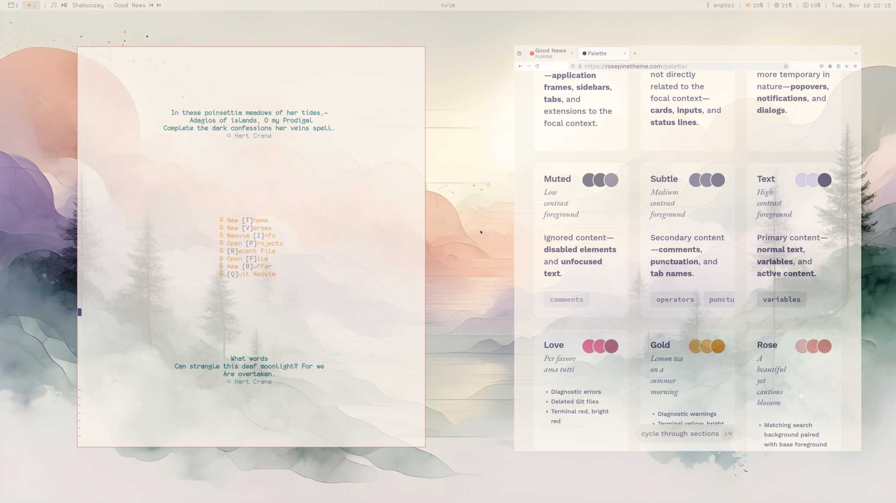
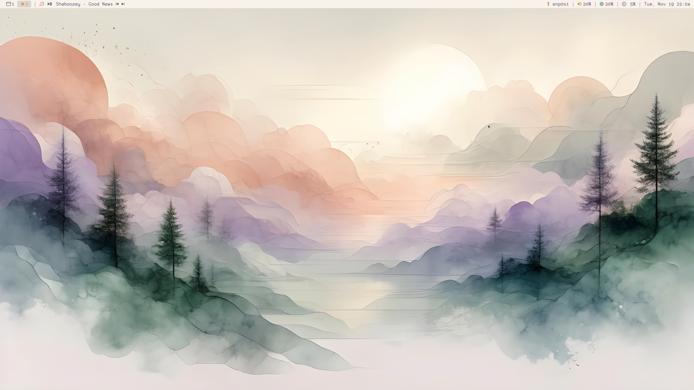
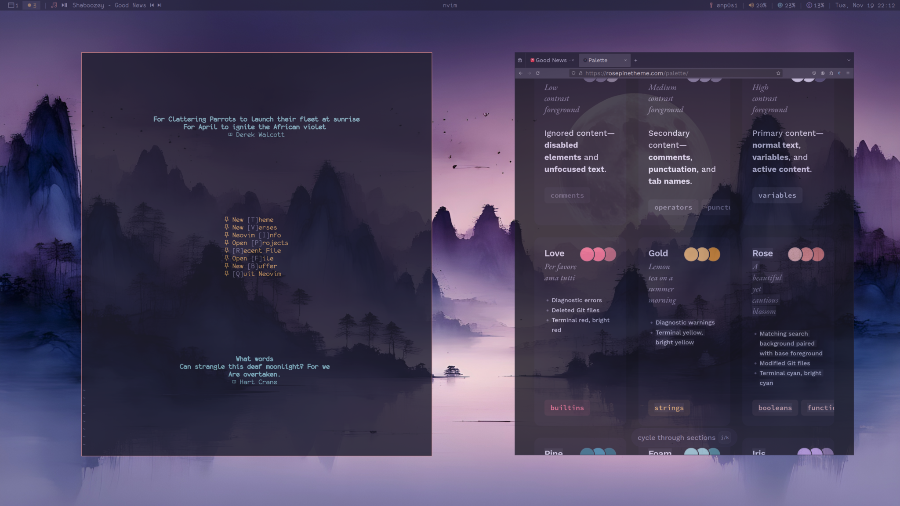
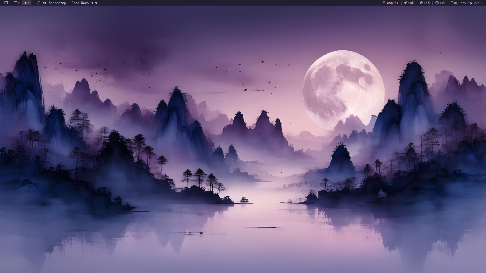

# Rice Configuration

- **Window Manager**: i3
- **Status Bar**: Polybar
- **Terminal Emulator**: Kitty
- **Web Browser**: Firefox
- **Text Editor**: Neovim (my configuration required for startup screen)
- **Compositor**: Picom
- **Application Launcher**: Rofi
- **Color Theme**: Rose Pine (Dawn/Moon variants)
- **Wall Paper**: Generated using stable diffusion v3.5

# Showcases

## Dawn Theme (7AM-11PM)




A serene workspace featuring misty mountains and soft pastels. The
light background complements the green text in Neovim, creating an
ideal environment for morning coding sessions.

## Moon Theme (11PM-7AM)




Night mode features deep purples and blues with cyan accents,
optimized for comfortable late-night viewing.

# Installation

This rice runs on openSUSE but is compatible with other Linux
distributions. The only adjustment needed is modifying the package
names to match your system's package manager.

Follow these steps to set up your configuration:

```sh
### Install the dotfiles ###
mkdir -p ~/Desktop
cd ~/Desktop
git clone https://github.com/milanglacier/i3-rosepine-dotfiles.git dotfiles
cd dotfiles

### Sync configuration files ###
mkdir -p ~/.config
ln -s $(pwd)/config/* ~/.config/
ln -s $(pwd)/.zshrc ~/.zshrc
ln -s $(pwd)/.zimfw-setup.sh ~/.zimfw-setup.sh
ln -s $(pwd)/.zimrc ~/.zimrc
ln -s $(pwd)/.zprofile ~/.zprofile
ln -s $(pwd)/.xinitrc ~/.xinitrc

### Install packages ###
# Execute package installation only for openSUSE systems.
# For other distributions, manual package installation is required.
if command -v zypper; then
    INSTALL_X=1 ./bin/install-from-package-managers
fi

# Install fonts and theme components
./bin/download-release-packages
./bin/download-rosepine-gtk3-theme.sh
./bin/download-rosepine-wallpapers.sh
./bin/download-rosepine-fcitx5-theme.sh

# Set ZSH as default shell
chsh -s $(which zsh)
# Launch ZSH to configure powerlevel10k
zsh
```

Optionally, you can use my neovim configuration:

```bash
cd ~/.config
git clone https://github.com/milanglacier/nvim.git
```

# Keybindings

Non-mode keymap:

| Keys | Description |
|------ |------------- |
| Super+Shift+c | Reload configuration file |
| Super+Shift+r | Restart i3 |
| Super+grave | Launch kitty terminal |
| Super+Return | Launch rofi application launcher |
| Alt+Tab | Show window switcher |
| Super+slash | Toggle input method |
| Super+q | Kill focused window |
| Super+h/j/k/l | Focus left/down/up/right |
| Super+semicolon | Focus parent |
| Super+colon | Focus child |
| Super+Shift+h/j/k/l | Move window left/down/up/right |
| Super+f | Toggle fullscreen |
| Super+[1-0] | Switch to workspace 1-10 |
| Super+F12 | Increase volume |
| Super+F11 | Decrease volume |
| Super+F10 | Toggle mute |
| XF86AudioRaiseVolume | Increase volume |
| XF86AudioLowerVolume | Decrease volume |
| XF86AudioMute | Toggle mute |
| XF86AudioMicMute | Toggle microphone mute |

Mode keymap:

| Keys | Description |
|------ |------------- |
| Super+o | Enter system mode |
| Super+w | Enter layout mode |
| Super+m | Enter move mode |
| Super+r | Enter resize mode |
| Super+n | Enter notification mode |

Layout mode options:

| Keys | Description |
|------ |------------- |
| v | Split vertically |
| s | Split horizontally |
| Shift+s | Stacking layout |
| t | Tabbed layout |
| z | Toggle split layout |
| space | Toggle floating |
| w | Toggle focus between tiled/floating |
| minus | Move to scratchpad |
| plus | Show scratchpad |

System mode options:

| Keys | Description |
|------ |-------------|
| l | Lock |
| q | Logout |
| r | Reboot |
| u | Switch user |
| h | Hibernate |
| s | Suspend |
| Shift+s | Shutdown |

Notification mode options:

| Keys | Description |
|------|------------- |
| p | Show previous notification |
| c | Close all notifications |
| k | Clear notification history |
| a | Show notification context |
| z | Toggle notifications |

Move mode options:

| Keys | Description |
|------|-------------------------- |
| h | Move window left |
| j | Move window down |
| k | Move window up |
| l | Move window right |
| 1-0 | Move container to workspace 1-10 |
| s | Rearrange workspaces sequentially |

# Notes

To enable the transparent window effect, uncomment the following line
and reload the i3 configuration:

```
# exec_always --no-startup-id ~/.config/picom/launch_picom.sh
```

# Useful Scripts

1. `change_color_scheme`
   - Switches between Rose Pine Dawn and Rose Pine Moon themes based
     on system time
   - Dawn theme: Active between 7AM and 11PM
   - Moon theme: Active between 11PM and 7AM
   - Override time-based selection using environment variable:
     `CURRENT_BACKGROUND=night change_color_scheme`

2. `xrandr-change-resolution.sh`
   - Modifies monitor resolution
   - Usage syntax: `sh xrandr-change-resolution.sh HDMI-1 2560 1600`
